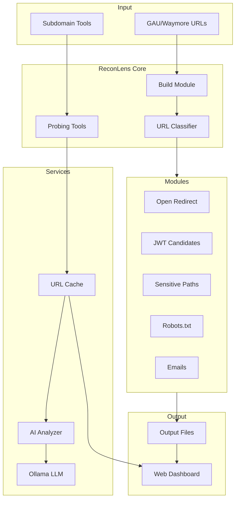

# ReconLens Documentation

Comprehensive documentation for the ReconLens bug bounty reconnaissance toolkit.

---

## Table of Contents

1. [Overview](#overview)
2. [Architecture](#architecture)
3. [Directory Structure](#directory-structure)
4. [Configuration](#configuration)
5. [Modules Reference](#modules-reference)
6. [Tools Reference](#tools-reference)
7. [Services Reference](#services-reference)
8. [API Endpoints](#api-endpoints)
9. [Workflow Guide](#workflow-guide)
10. [External Tools Setup](#external-tools-setup)

---

## Overview

**ReconLens** is a Python-based bug bounty reconnaissance toolkit with a FastAPI web dashboard. It simplifies recon workflows by providing:

- **URL Collection**: Gather endpoints from GAU, Waymore
- **Subdomain Enumeration**: Amass, Subfinder, Findomain support
- **Security Analysis**: Detect sensitive paths, open redirects, JWT tokens, emails
- **AI Triage**: LLM-powered URL classification (HIGH/MEDIUM/LOW/INFO)
- **Visualization**: Interactive dashboard with graphs and filters

### Technology Stack

| Component | Technology |
|-----------|------------|
| Backend | Python 3.10+, FastAPI, Uvicorn |
| Frontend | Jinja2 Templates, HTML/JS |
| HTTP Client | httpx (async) |
| LLM | Ollama (localhost:11434) |
| Config | YAML |

---

## Architecture



### Data Flow

1. **Target Setup**: Add target domain/scope
2. **URL Collection**: Run GAU/Waymore to gather archived URLs
3. **Build Module**: Process and categorize URLs based on `config.yaml` rules
4. **Module Analysis**: Run detection modules (open_redirect, jwt, etc.)
5. **Probing**: HTTP probe subdomains and URLs
6. **AI Classification**: Optional LLM-based risk triage
7. **Dashboard**: View results in web UI

---

## Directory Structure

```
ReconLens/
├── __main__.py          # CLI entry point for URL classification
├── config.yaml          # Category rules configuration
├── requirements.txt     # Python dependencies
│
├── app/                 # FastAPI web application
│   ├── main.py          # App factory, middleware
│   ├── config.py        # Settings
│   ├── deps.py          # Dependencies
│   ├── core/            # Core utilities
│   │   ├── config_store.py
│   │   ├── fs.py        # File system helpers
│   │   ├── meta.py      # Metadata handling
│   │   ├── modules.py
│   │   ├── routers.py   # Auto router loader
│   │   └── templates.py
│   ├── routers/         # API endpoints
│   │   ├── home.py
│   │   ├── viewer.py    # Module viewer
│   │   ├── subdomains.py
│   │   ├── targets.py
│   │   ├── ai.py        # AI endpoints
│   │   ├── graphs/      # Graph API endpoints
│   │   └── targets/     # Target management
│   ├── services/        # Business logic
│   │   ├── ai_analyzer.py
│   │   ├── ai_client.py
│   │   ├── llm_provider.py
│   │   ├── enrich_urls.py
│   │   ├── enrich_subdomains.py
│   │   └── url_cache.py
│   ├── templates/       # Jinja2 HTML templates
│   └── static/          # CSS/JS assets
│
├── core/                # Shared utilities
│   ├── io_utils.py      # File I/O (atomic writes, gzip)
│   ├── url_utils.py     # URL parsing
│   ├── scope.py         # Scope checking
│   └── progress.py      # Progress bar wrapper
│
├── modules/             # Analysis modules
│   ├── open_redirect.py
│   ├── jwt_candidates.py
│   ├── sensitive_paths.py
│   ├── sensitive_params.py
│   ├── robots.py
│   ├── emails.py
│   ├── documents.py
│   ├── subdomains.py
│   └── params.py
│
├── tools/               # Probing tools
│   ├── probe_subdomains.py
│   ├── probe_urls.py
│   └── probe_paths.py
│
├── outputs/             # Results directory (per target)
└── data/
    └── wordlists/       # Wordlists for fuzzing
```

---

## Configuration

### config.yaml

Defines URL categorization rules:

```yaml
global:
  include_external: false    # Only process in-scope URLs
  dedup_case_insensitive: true

categories:
  auth_login:
    enabled: true
    path_regex: ["/(login|signin|auth|oauth|sso)(/|$)"]
    query_keys: ["redirect_uri", "client_id", "return", "next"]
  
  admin_panel:
    enabled: true
    path_regex: ["/(admin|administrator|dashboard|cpanel)(/|$)"]
  
  api:
    enabled: true
    host_startswith: ["api."]
    path_regex: ["^/api/", "/graphql", "/v[0-9]+/"]
  
  # ... more categories
```

### Category Rule Options

| Option | Description |
|--------|-------------|
| `enabled` | Enable/disable category |
| `host_regex` | Match against hostname |
| `host_startswith` | Hostname prefix match |
| `path_regex` | Match against URL path |
| `query_keys` | Match query parameter names |
| `extensions` | Match file extensions |

---

## Modules Reference

### open_redirect

Detects URLs with redirect-prone parameters.

**Default Parameters Checked:**
`url`, `next`, `redirect`, `return`, `continue`, `callback`, `dest`, `destination`, `target`, `go`, `link`, `to`, `redir`, `returnurl`, `service`

**Output:** `open_redirect_candidates.txt`

**CLI Usage:**
```bash
python -m modules.open_redirect \
  --scope example.com \
  --input urls.txt \
  --out ./outputs/example.com/
```

---

### jwt_candidates

Extracts URLs containing JWT tokens using base64 header validation.

**Detection Method:**
- Regex for 3-part (JWS) or 5-part (JWE) base64url segments
- Validates first segment decodes to JSON with `alg` key
- Checks path, query params, and fragments

**Output:** `jwt_candidates.txt`

---

### sensitive_paths

Finds URLs with admin, login, debug, and config paths.

**Default Patterns:**
- `/admin`, `/login`, `/dashboard`, `/console`
- `/wp-admin`, `/phpmyadmin`, `/adminer`
- `/swagger`, `/graphql`, `/graphiql`
- `/actuator`, `/jenkins`, `/grafana`
- `/kibana`, `/prometheus`, `/metrics`

**Output:** `sensitive_paths.txt`

---

### robots

Collects and parses robots.txt files.

**Features:**
- Collect robots.txt URLs from input
- Parse Disallow directives from local robot files

**Output:**
- `robots_urls.txt`
- `robots_disallow.txt` (optional)

---

### emails

Extracts email addresses from URLs.

**Features:**
- Extract from query params and path segments
- Whitelist common email providers (gmail, yahoo, etc.)
- Optional masking (user@domain → u***r@domain)

**Output:**
- `emails_urls.txt`
- `emails_found.txt` (optional)

---

### documents

Detects document file URLs.

**Extensions:** `.pdf`, `.doc`, `.docx`, `.xls`, `.xlsx`, `.csv`, `.zip`, `.gz`, `.tar`, `.sql`, `.bak`, `.log`

---

### sensitive_params

Detects sensitive query parameters like `password`, `token`, `api_key`, `secret`.

---

### params

Extracts and analyzes all query parameters for statistical analysis.

---

## Tools Reference

### probe_subdomains.py

Async HTTP probing for subdomains.

**Features:**
- Concurrent probing with httpx
- DNS resolution
- Title extraction
- Status code, content-type, size tracking
- IP clustering

**Output Files:**
- `__cache/subdomain_enrich.json`
- `__cache/subdomain_probe.ndjson`
- `rollup_group_by_ip.json`

**CLI:**
```bash
python -m tools.probe_subdomains \
  --scope example.com \
  --subdomains subdomains.txt \
  --outputs ./outputs/ \
  --concurrency 50 \
  --timeout 10
```

---

### probe_urls.py

Bulk URL probing with enrichment data.

**Features:**
- HTTP status checking
- Content-type detection
- Response size
- Timestamp tracking

---

### probe_paths.py

Directory/path fuzzing integration.

**Features:**
- Dirsearch integration
- Custom wordlist support
- Result aggregation

---

## Services Reference

### AI Analyzer (`ai_analyzer.py`)

URL classification using LLM.

**Risk Levels:**
| Level | Description |
|-------|-------------|
| HIGH | `.git`, `.env`, `config.php`, `backup.zip`, exposed admin/debug |
| MEDIUM | `/admin/` (unknown auth), `/wp-admin/`, upload dirs |
| LOW | Normal docs, news pages |
| INFO | Static assets (images, CSS, JS) |

**Output:** `__cache/ai_classify.json`

---

### LLM Provider (`llm_provider.py`)

Ollama integration for security triage.

**Configuration:**
```python
OllamaProvider(
    model="llama3.1:8b",
    base_url="http://localhost:11434",
    timeout=30
)
```

**Environment Variables:**
- `AI_MODEL`: Override model name

---

### URL Cache (`url_cache.py`)

Caches probe results for fast lookups.

---

## API Endpoints

### Targets

| Method | Endpoint | Description |
|--------|----------|-------------|
| GET | `/targets` | List all targets |
| POST | `/targets/api/add` | Add new target |
| GET | `/targets/{scope}` | Target overview |

### Subdomains

| Method | Endpoint | Description |
|--------|----------|-------------|
| GET | `/targets/{scope}/subdomains` | Subdomain list page |
| POST | `/targets/{scope}/subdomains/collect` | Run subdomain enumeration |
| POST | `/targets/{scope}/subdomains/probe` | Probe subdomains |

### Modules

| Method | Endpoint | Description |
|--------|----------|-------------|
| GET | `/targets/{scope}/module/{module}` | Module results page |
| GET | `/targets/{scope}/module/{module}/list.json` | JSON results |
| GET | `/targets/{scope}/module/{module}/download` | Download raw file |

### AI

| Method | Endpoint | Description |
|--------|----------|-------------|
| POST | `/targets/{scope}/ai/classify` | Run AI classification |
| GET | `/targets/{scope}/ai/results` | Get classification results |

### Graphs

| Method | Endpoint | Description |
|--------|----------|-------------|
| GET | `/graphs/{scope}/status-codes` | HTTP status distribution |
| GET | `/graphs/{scope}/ip-clusters` | IP clustering view |
| GET | `/graphs/{scope}/subdomains` | Subdomain graph |

---

## Workflow Guide

### 1. Add Target

Start by adding a target domain:
- Go to dashboard → Add Target
- Enter root domain (e.g., `example.com`)

### 2. URL Collection

Run GAU or Waymore to gather archived URLs:
```bash
gau example.com > outputs/example.com/urls.txt
# or
waymore -i example.com -mode U -oU outputs/example.com/urls.txt
```

### 3. Build Module

Process and categorize URLs:
- Go to Target → Build Module
- This creates category-based modules based on `config.yaml` rules

### 4. Analyze Modules

Open any generated module to view results:
- Open Redirect candidates
- JWT tokens
- Sensitive paths
- etc.

### 5. Subdomain Operations

From the Subdomain menu:
- **(Re)collect** - Run Subfinder/Amass/Findomain
- **(Re)probe** - Check if subdomains are alive
- **Dirsearch** - Fuzz directories

### 6. AI Classification (Optional)

Run AI analysis for risk triage:
- Requires Ollama running locally
- Classifies URLs as HIGH/MEDIUM/LOW/INFO

---

## External Tools Setup

### Required: Go Tools

```bash
# GAU (URL collection)
go install github.com/lc/gau/v2/cmd/gau@latest

# Subfinder (subdomain enum)
go install github.com/projectdiscovery/subfinder/v2/cmd/subfinder@latest

# Amass (subdomain enum)
go install github.com/owasp-amass/amass/v4/...@latest
```

### Optional: Ollama (AI)

```bash
# Install Ollama
curl -fsSL https://ollama.com/install.sh | sh

# Pull model
ollama pull llama3.1:8b

# Start server (default: localhost:11434)
ollama serve
```

---

## Running the Application

```bash
# Setup virtual environment
python3 -m venv venv
source venv/bin/activate

# Install dependencies
pip install -r requirements.txt

# Run server
uvicorn app.main:app --port 8000
```

Access dashboard at: `http://localhost:8000`

---

## License

Created by Prasetia Ari with assistance from ChatGPT-5.

---

*Documentation generated for ReconLens v0.2.0*
