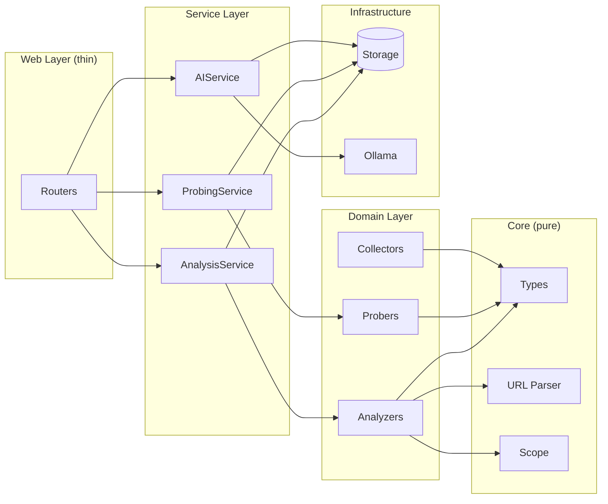

# ReconLens Architecture Refactoring Design

## Executive Summary

Dokumen ini berisi rancangan arsitektur baru untuk ReconLens yang lebih modular, maintainable, dan extensible. Tujuan utama: **perubahan di satu modul tidak akan mempengaruhi modul lain.**

---

## Table of Contents

1. [Current Problems](#current-problems)
2. [Design Principles](#design-principles)
3. [New Architecture](#new-architecture)
4. [Core Components](#core-components)
5. [Implementation Details](#implementation-details)
6. [Migration Strategy](#migration-strategy)
7. [File-by-File Changes](#file-by-file-changes)

---

## Current Problems

### 1. Code Duplication
Setiap module (`open_redirect.py`, `jwt_candidates.py`, etc.) punya pattern yang sama:

```python
# Pattern yang diulang di SETIAP module:
def run(input_path, output_dir, scope, ...):
    lines = list(read_nonempty_lines(input_path))   # ← duplicated
    urls: set[str] = set()
    
    for url in progress(lines, ...):                 # ← duplicated
        parsed = parse_url(url)                      # ← duplicated
        if not parsed.get("valid"):                  # ← duplicated
            continue
        host = parsed.get("host")                    # ← duplicated
        if not is_in_scope(host, scope, ...):        # ← duplicated
            continue
        
        # HANYA INI yang berbeda per module:
        if _module_specific_check(parsed):
            urls.add(parsed["url_raw"])
    
    write_lines_simple(out_file, sorted(urls))       # ← duplicated
```

**Impact:** Bug fix di logic loop = edit 9 file. Risiko miss salah satu.

### 2. Mixed Responsibilities
- `app/core/` DAN `core/` di root → confusing
- Router files mix between logic dan presentation
- No clear boundary antara I/O dan business logic

### 3. Tight Coupling
- Hardcoded paths: `outputs/`, `__cache/`
- Direct file operations scattered everywhere
- Sulit untuk test karena tightly coupled ke filesystem

---

## Design Principles

| Principle | Description |
|-----------|-------------|
| **Single Responsibility** | Setiap class/function punya 1 job |
| **Dependency Injection** | Dependencies di-pass, bukan di-import langsung |
| **Interface Segregation** | Small, focused interfaces |
| **Open/Closed** | Open for extension, closed for modification |
| **Don't Repeat Yourself** | Common logic extracted ke base classes |

---

## New Architecture

### High-Level Structure

```
reconlens/                      # Single source of truth
├── __init__.py
├── config.py                   # Central configuration
│
├── core/                       # Pure utilities (NO side effects)
│   ├── __init__.py
│   ├── types.py                # All dataclasses & type definitions
│   ├── url.py                  # URL parsing (stateless)
│   ├── scope.py                # Scope checking (stateless)
│   └── exceptions.py           # Custom exceptions
│
├── analyzers/                  # Detection modules (stateless)
│   ├── __init__.py             # Registry & factory
│   ├── base.py                 # Abstract base class
│   ├── open_redirect.py
│   ├── jwt.py
│   ├── sensitive_paths.py
│   ├── sensitive_params.py
│   ├── robots.py
│   ├── emails.py
│   ├── documents.py
│   └── params.py
│
├── collectors/                 # External tool wrappers
│   ├── __init__.py
│   ├── base.py
│   ├── gau.py
│   ├── waymore.py
│   ├── subfinder.py
│   ├── amass.py
│   └── findomain.py
│
├── probers/                    # HTTP probing (async)
│   ├── __init__.py
│   ├── base.py
│   ├── http.py
│   ├── dns.py
│   └── directory.py
│
├── storage/                    # Data persistence (abstracted)
│   ├── __init__.py
│   ├── base.py                 # Abstract interface
│   ├── filesystem.py           # File-based implementation
│   └── models.py               # Storage models
│
├── services/                   # Business logic orchestration
│   ├── __init__.py
│   ├── target.py
│   ├── analysis.py
│   ├── probing.py
│   └── ai.py
│
├── ai/                         # AI/LLM integration
│   ├── __init__.py
│   ├── base.py
│   ├── ollama.py
│   └── classifier.py
│
├── web/                        # FastAPI (thin layer)
│   ├── __init__.py
│   ├── app.py
│   ├── deps.py                 # Dependency injection
│   ├── routers/
│   │   ├── targets.py
│   │   ├── subdomains.py
│   │   ├── modules.py
│   │   ├── ai.py
│   │   └── graphs.py
│   ├── templates/
│   └── static/
│
└── cli/                        # CLI interface
    ├── __init__.py
    └── main.py

tests/                          # Pytest tests
├── conftest.py                 # Fixtures
├── test_core/
├── test_analyzers/
├── test_collectors/
├── test_probers/
├── test_storage/
└── test_services/

config/
├── default.yaml
└── categories.yaml
```

---

## Core Components

### 1. Type Definitions (`core/types.py`)

```python
from dataclasses import dataclass, field
from typing import Optional, Set, Dict, List
from enum import Enum

class RiskLevel(Enum):
    HIGH = "HIGH"
    MEDIUM = "MEDIUM"
    LOW = "LOW"
    INFO = "INFO"

@dataclass(frozen=True)
class ParsedURL:
    """Immutable parsed URL representation."""
    raw: str
    scheme: str
    host: str
    port: Optional[int]
    path: str
    query: str
    fragment: str
    params: Dict[str, List[str]] = field(default_factory=dict)
    
    @property
    def is_valid(self) -> bool:
        return bool(self.host)

@dataclass
class AnalysisResult:
    """Result from any analyzer."""
    analyzer_name: str
    matched_urls: Set[str] = field(default_factory=set)
    metadata: Dict = field(default_factory=dict)
    
@dataclass
class ProbeResult:
    """Result from HTTP probing."""
    url: str
    host: str
    alive: bool
    status_code: Optional[int] = None
    content_type: Optional[str] = None
    size: Optional[int] = None
    title: Optional[str] = None
    ips: List[str] = field(default_factory=list)
    error: Optional[str] = None

@dataclass
class Target:
    """Target scope definition."""
    scope: str  # e.g., "example.com"
    include_external: bool = False
    allow_subdomains: List[str] = field(default_factory=list)
    deny_subdomains: List[str] = field(default_factory=list)
```

---

### 2. Base Analyzer (`analyzers/base.py`)

```python
from abc import ABC, abstractmethod
from typing import Iterable, Optional
from reconlens.core.types import ParsedURL, AnalysisResult, Target
from reconlens.core.url import parse_url
from reconlens.core.scope import is_in_scope

class BaseAnalyzer(ABC):
    """
    Abstract base class for all analyzers.
    
    Subclasses only need to implement:
    - name: str
    - should_include(parsed: ParsedURL) -> bool
    """
    
    @property
    @abstractmethod
    def name(self) -> str:
        """Unique identifier for this analyzer."""
        pass
    
    @property
    def output_filename(self) -> str:
        """Default output filename."""
        return f"{self.name}.txt"
    
    @abstractmethod
    def should_include(self, parsed: ParsedURL) -> bool:
        """
        Return True if this URL matches analyzer criteria.
        This is the ONLY method subclasses must implement.
        """
        pass
    
    def analyze(
        self,
        urls: Iterable[str],
        target: Target,
        progress_callback: Optional[callable] = None
    ) -> AnalysisResult:
        """
        Main analysis loop. DO NOT OVERRIDE unless absolutely necessary.
        All common logic is here.
        """
        matched: set[str] = set()
        total = 0
        
        for raw_url in urls:
            total += 1
            
            # Parse URL
            parsed = parse_url(raw_url)
            if not parsed.is_valid:
                continue
            
            # Scope check
            if not target.include_external:
                if not is_in_scope(
                    parsed.host, 
                    target.scope,
                    target.allow_subdomains,
                    target.deny_subdomains
                ):
                    continue
            
            # Module-specific check
            if self.should_include(parsed):
                matched.add(parsed.raw)
            
            # Optional progress callback
            if progress_callback:
                progress_callback(total)
        
        return AnalysisResult(
            analyzer_name=self.name,
            matched_urls=matched,
            metadata={"total_processed": total}
        )
```

---

### 3. Example Analyzer: Open Redirect (`analyzers/open_redirect.py`)

```python
from reconlens.analyzers.base import BaseAnalyzer
from reconlens.core.types import ParsedURL

class OpenRedirectAnalyzer(BaseAnalyzer):
    """Detect URLs with redirect-prone parameters."""
    
    REDIRECT_PARAMS = frozenset([
        "url", "next", "redirect", "return", "continue", "callback",
        "dest", "destination", "target", "go", "link", "to", "redir",
        "returnurl", "service", "u", "ru", "ref", "site", "path"
    ])
    
    @property
    def name(self) -> str:
        return "open_redirect"
    
    def should_include(self, parsed: ParsedURL) -> bool:
        """Check if URL has any redirect-prone parameters."""
        param_keys = {k.lower() for k in parsed.params.keys()}
        return bool(param_keys & self.REDIRECT_PARAMS)
```

**Note:** Dari ~100 lines menjadi ~20 lines. Semua boilerplate ada di `BaseAnalyzer`.

---

### 4. Analyzer Registry (`analyzers/__init__.py`)

```python
from typing import Dict, Type
from reconlens.analyzers.base import BaseAnalyzer
from reconlens.analyzers.open_redirect import OpenRedirectAnalyzer
from reconlens.analyzers.jwt import JWTAnalyzer
from reconlens.analyzers.sensitive_paths import SensitivePathsAnalyzer
# ... import all

# Auto-registry
_ANALYZERS: Dict[str, Type[BaseAnalyzer]] = {}

def register(cls: Type[BaseAnalyzer]) -> Type[BaseAnalyzer]:
    """Decorator to register an analyzer."""
    _ANALYZERS[cls().name] = cls
    return cls

def get_analyzer(name: str) -> BaseAnalyzer:
    """Factory function to get analyzer instance."""
    if name not in _ANALYZERS:
        raise ValueError(f"Unknown analyzer: {name}")
    return _ANALYZERS[name]()

def list_analyzers() -> list[str]:
    """List all registered analyzer names."""
    return list(_ANALYZERS.keys())

# Register all built-in analyzers
register(OpenRedirectAnalyzer)
register(JWTAnalyzer)
register(SensitivePathsAnalyzer)
# ... register all
```

---

### 5. Storage Interface (`storage/base.py`)

```python
from abc import ABC, abstractmethod
from pathlib import Path
from typing import Set, Optional, Iterator
from reconlens.core.types import AnalysisResult, ProbeResult

class BaseStorage(ABC):
    """
    Abstract interface for data persistence.
    Implementations can be file-based, database, or cloud.
    """
    
    @abstractmethod
    def save_analysis(self, scope: str, result: AnalysisResult) -> None:
        """Save analysis results."""
        pass
    
    @abstractmethod
    def load_analysis(self, scope: str, analyzer_name: str) -> Optional[AnalysisResult]:
        """Load analysis results."""
        pass
    
    @abstractmethod
    def save_urls(self, scope: str, name: str, urls: Set[str]) -> int:
        """Save URL set. Returns count saved."""
        pass
    
    @abstractmethod
    def load_urls(self, scope: str, name: str) -> Set[str]:
        """Load URL set."""
        pass
    
    @abstractmethod
    def iter_urls(self, scope: str, name: str) -> Iterator[str]:
        """Iterate URLs without loading all into memory."""
        pass
    
    @abstractmethod
    def save_probe_result(self, scope: str, result: ProbeResult) -> None:
        """Save single probe result."""
        pass
    
    @abstractmethod
    def list_scopes(self) -> list[str]:
        """List all target scopes."""
        pass
```

---

### 6. File Storage Implementation (`storage/filesystem.py`)

```python
from pathlib import Path
from typing import Set, Optional, Iterator
import json
from reconlens.storage.base import BaseStorage
from reconlens.core.types import AnalysisResult, ProbeResult
from reconlens.core.io import atomic_write, read_lines

class FileSystemStorage(BaseStorage):
    """File-based storage implementation."""
    
    def __init__(self, base_dir: Path):
        self.base_dir = Path(base_dir)
    
    def _scope_dir(self, scope: str) -> Path:
        return self.base_dir / scope
    
    def _cache_dir(self, scope: str) -> Path:
        return self._scope_dir(scope) / "__cache"
    
    def save_analysis(self, scope: str, result: AnalysisResult) -> None:
        path = self._scope_dir(scope) / result.output_filename
        atomic_write(path, "\n".join(sorted(result.matched_urls)))
    
    def load_urls(self, scope: str, name: str) -> Set[str]:
        path = self._scope_dir(scope) / f"{name}.txt"
        if not path.exists():
            return set()
        return set(read_lines(path))
    
    def iter_urls(self, scope: str, name: str) -> Iterator[str]:
        path = self._scope_dir(scope) / f"{name}.txt"
        if path.exists():
            yield from read_lines(path)
    
    # ... implement other methods
```

---

### 7. Analysis Service (`services/analysis.py`)

```python
from typing import List, Optional
from reconlens.analyzers import get_analyzer, list_analyzers
from reconlens.storage.base import BaseStorage
from reconlens.core.types import Target, AnalysisResult

class AnalysisService:
    """Orchestrates analysis operations."""
    
    def __init__(self, storage: BaseStorage):
        self.storage = storage
    
    def run_analyzer(
        self,
        target: Target,
        analyzer_name: str,
        input_name: str = "urls",
        progress_callback: Optional[callable] = None
    ) -> AnalysisResult:
        """Run single analyzer on target."""
        
        # Get analyzer
        analyzer = get_analyzer(analyzer_name)
        
        # Load input URLs
        urls = self.storage.iter_urls(target.scope, input_name)
        
        # Run analysis
        result = analyzer.analyze(urls, target, progress_callback)
        
        # Save results
        self.storage.save_analysis(target.scope, result)
        
        return result
    
    def run_all_analyzers(
        self,
        target: Target,
        input_name: str = "urls"
    ) -> List[AnalysisResult]:
        """Run all registered analyzers."""
        results = []
        for name in list_analyzers():
            result = self.run_analyzer(target, name, input_name)
            results.append(result)
        return results
```

---

### 8. Dependency Injection (`web/deps.py`)

```python
from functools import lru_cache
from pathlib import Path
from reconlens.storage.filesystem import FileSystemStorage
from reconlens.services.analysis import AnalysisService
from reconlens.services.probing import ProbingService
from reconlens.services.ai import AIService
from reconlens.config import get_settings

@lru_cache
def get_storage() -> FileSystemStorage:
    settings = get_settings()
    return FileSystemStorage(base_dir=settings.outputs_dir)

@lru_cache
def get_analysis_service() -> AnalysisService:
    return AnalysisService(storage=get_storage())

@lru_cache
def get_probing_service() -> ProbingService:
    return ProbingService(storage=get_storage())

@lru_cache
def get_ai_service() -> AIService:
    return AIService(storage=get_storage())
```

---

### 9. Thin Router (`web/routers/modules.py`)

```python
from fastapi import APIRouter, Depends, Request
from reconlens.web.deps import get_analysis_service
from reconlens.services.analysis import AnalysisService
from reconlens.core.types import Target

router = APIRouter(prefix="/targets/{scope}/module")

@router.post("/{module}/run")
async def run_module(
    scope: str,
    module: str,
    service: AnalysisService = Depends(get_analysis_service)
):
    """Run specific analyzer module."""
    target = Target(scope=scope)
    result = service.run_analyzer(target, module)
    return {
        "module": module,
        "matched": len(result.matched_urls),
        "total_processed": result.metadata.get("total_processed", 0)
    }

@router.get("/{module}")
async def view_module(
    scope: str,
    module: str,
    request: Request,
    service: AnalysisService = Depends(get_analysis_service)
):
    """View module results page."""
    # Just render template, no business logic here
    return templates.TemplateResponse(...)
```

---

## Component Interaction Diagram



---

## Migration Strategy

### Phase 1: Foundation (Week 1)
- [ ] Create `reconlens/core/types.py`
- [ ] Create `reconlens/core/url.py` (refactor dari `core/url_utils.py`)
- [ ] Create `reconlens/core/scope.py` (refactor dari `core/scope.py`)
- [ ] Create `reconlens/core/io.py` (refactor dari `core/io_utils.py`)
- [ ] Add type hints ke semua core functions

### Phase 2: Base Analyzer (Week 1)
- [ ] Create `reconlens/analyzers/base.py`
- [ ] Migrate `open_redirect.py` sebagai pilot
- [ ] Create unit tests untuk base + open_redirect

### Phase 3: Migrate All Analyzers (Week 2)
- [ ] Migrate `jwt_candidates.py`
- [ ] Migrate `sensitive_paths.py`
- [ ] Migrate `sensitive_params.py`
- [ ] Migrate `robots.py`
- [ ] Migrate `emails.py`
- [ ] Migrate `documents.py`
- [ ] Migrate `params.py`
- [ ] Create registry di `analyzers/__init__.py`

### Phase 4: Storage Layer (Week 2)
- [ ] Create `reconlens/storage/base.py`
- [ ] Create `reconlens/storage/filesystem.py`
- [ ] Migrate existing file operations

### Phase 5: Services (Week 3)
- [ ] Create `reconlens/services/analysis.py`
- [ ] Create `reconlens/services/probing.py`
- [ ] Create `reconlens/services/ai.py`
- [ ] Create dependency injection setup

### Phase 6: Web Layer (Week 3)
- [ ] Refactor routers to use services
- [ ] Remove business logic from routers
- [ ] Update templates as needed

### Phase 7: Testing & Cleanup (Week 4)
- [ ] Add pytest for all components
- [ ] Remove old duplicate code
- [ ] Update documentation

---

## Testing Strategy

### Unit Tests

```python
# tests/test_analyzers/test_open_redirect.py
import pytest
from reconlens.analyzers.open_redirect import OpenRedirectAnalyzer
from reconlens.core.types import ParsedURL, Target

class TestOpenRedirectAnalyzer:
    
    @pytest.fixture
    def analyzer(self):
        return OpenRedirectAnalyzer()
    
    def test_detects_redirect_param(self, analyzer):
        parsed = ParsedURL(
            raw="https://example.com/login?next=https://evil.com",
            scheme="https",
            host="example.com",
            path="/login",
            query="next=https://evil.com",
            params={"next": ["https://evil.com"]}
        )
        assert analyzer.should_include(parsed) is True
    
    def test_ignores_safe_params(self, analyzer):
        parsed = ParsedURL(
            raw="https://example.com/page?id=123",
            scheme="https",
            host="example.com",
            path="/page",
            query="id=123",
            params={"id": ["123"]}
        )
        assert analyzer.should_include(parsed) is False
```

### Integration Tests

```python
# tests/test_services/test_analysis.py
import pytest
from reconlens.services.analysis import AnalysisService
from reconlens.storage.filesystem import FileSystemStorage
from reconlens.core.types import Target

class TestAnalysisService:
    
    @pytest.fixture
    def service(self, tmp_path):
        storage = FileSystemStorage(base_dir=tmp_path)
        return AnalysisService(storage=storage)
    
    def test_run_analyzer_end_to_end(self, service, tmp_path):
        # Setup
        scope_dir = tmp_path / "example.com"
        scope_dir.mkdir()
        (scope_dir / "urls.txt").write_text(
            "https://example.com/login?next=https://evil.com\n"
            "https://example.com/page?id=123\n"
        )
        
        # Execute
        target = Target(scope="example.com")
        result = service.run_analyzer(target, "open_redirect")
        
        # Verify
        assert len(result.matched_urls) == 1
        assert "next=https://evil.com" in list(result.matched_urls)[0]
```

---

## Benefits Summary

| Before | After |
|--------|-------|
| 9 modules × ~100 lines each = 900 lines duplicate | 1 base class + 9 × ~20 lines = ~280 lines |
| Change loop logic = edit 9 files | Change loop logic = edit 1 file |
| Tightly coupled to filesystem | Storage interface: swap anytime |
| No tests | Testable at every layer |
| Mixed concerns in routers | Clean separation of concerns |
| Adding new analyzer = copy-paste-modify | Adding new analyzer = 20 lines |

---

## Questions for Review

1. **Naming conventions** - Apakah nama-nama seperti `analyzers/`, `probers/` sudah cukup jelas?
2. **Backward compatibility** - Perlu maintain old CLI interface?
3. **Database support** - Mau sekalian prepare for SQLite atau file-based dulu cukup?
4. **AI service refactor** - Ollama integration perlu di-refactor juga?

---

*Design Document v1.0 - ReconLens Modular Architecture*
